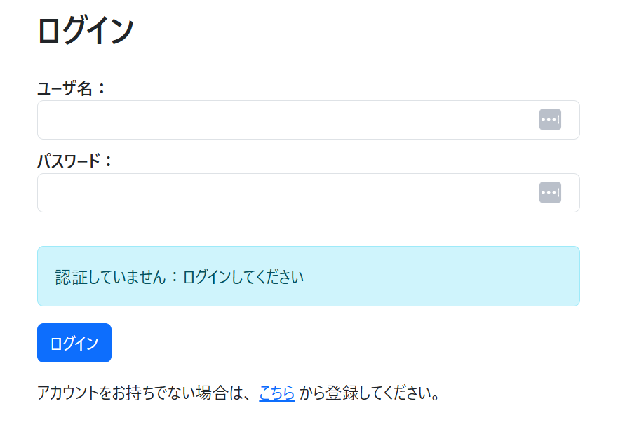
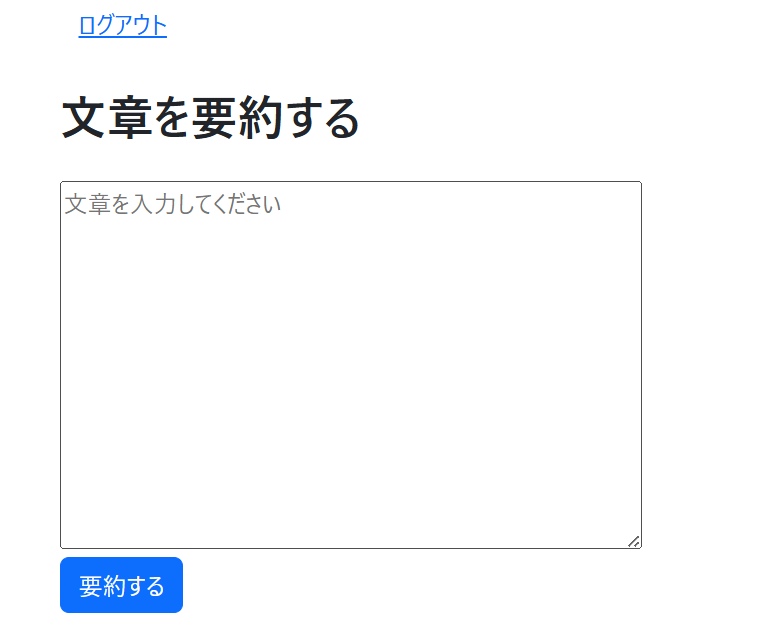
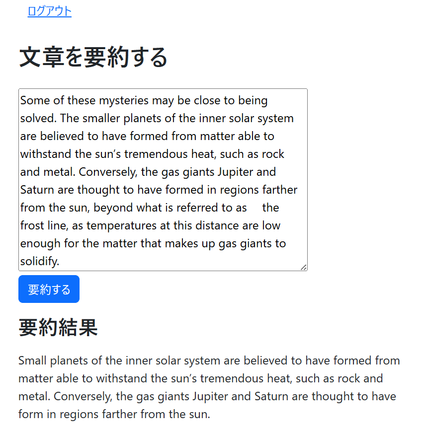

# Flask Summarize App

## 📌 概要
Flaskを使ったシンプルなテキスト要約Webアプリケーションです。Hugging Faceのtransformersを利用しています。

---

## 💻 機能

- ユーザー認証（ログイン、ログアウト、サインアップ）
- Hugging Faceの`facebook/bart-large-cnn`を使った文章要約
- Flask + SQLAlchemy + Flask-Login + Flask-WTFを使用
- SQLiteでユーザー管理
- モデルの遅延ロードにより起動速度を改善

---

## 🛠 技術スタック

- Python 3.13.7
- Flask 3.1.2
- Flask-Login 0.6.3
- Flask-WTF 1.2.2
- Flask-Migrate 4.1.0
- SQLAlchemy
- Transformers (要約モデル)
- SQLite (データベース)

---

## 📸 スクリーンショット

- ログイン画面


- ユーザー登録画面


- 要約画面


- 要約結果画面


---

## 🚀 セットアップ方法

1. リポジトリをクローン：

```bash
git clone
cd Flask_Summarize
```

2. Python の仮想環境を作成・有効化
```
python -m venv venv
source venv/bin/activate  # macOS/Linux
venv\Scripts\activate     # Windows
```

3. 必要パッケージをインストール
```
pip install -r requirements.txt
```

4. データベース作成
```
flask db init
flask db migrate -m "Initial migration"
flask db upgrade
```

5. アプリ実行
```
python app.py
```

---

## 📝 使い方

1. `/auth/register` でユーザー登録
2. `/auth` でログイン
3. `/summarize` で文章を入力して要約を取得

---

## 📂 フォルダ構成
```
Flask_Summarize/
├─ app.py
├─ config.py
├─ models.py
├─ forms.py
├─ views.py
├─ auth/
│  ├─ __init__.py
│  └─ views.py
├─ summarize/
│  ├─ __init__.py
│  └─ views.py
├─ templates/
│  ├─ base.html
│  ├─ _formhelpers.html
│  ├─ auth/
│  │  ├─ login_form.html
│  │  └─ register_form.html
│  ├─ summarize/
│  │  └─ index.html
│  └─ errors/
│     └─ 404.html
├─ static/
├─ images/
├─ requirements.txt
└─ README.md
```


